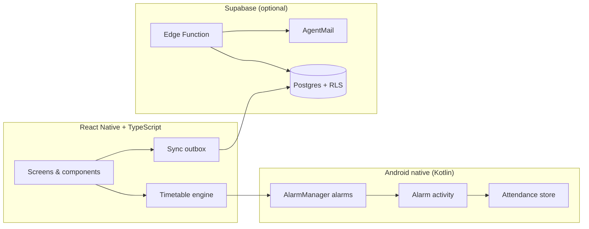

<div align="center">


# MyClassu

**Never miss a class again.** A calm, offline-first university timetable,
reminder, and attendance tracker for Android.

[](https://reactnative.dev/)
[](https://www.typescriptlang.org/)
[](https://developer.android.com/)
[](https://github.com/ToTheBlankWorld/MyClassu)

[Repository](https://github.com/ToTheBlankWorld/MyClassu) · [Architecture](docs/ARCHITECTURE.md) · [Release guide](docs/RELEASE.md)

</div>

---

## Table of contents

- [Overview](#-overview)
- [Key features](#-key-features)
- [Screenshots and app icon](#-screenshots-and-app-icon)
- [How it works](#-how-it-works)
- [Architecture](#-architecture)
- [Technology stack](#-technology-stack)
- [Getting started](#-getting-started)
- [Configuration and environment variables](#-configuration-and-environment-variables)
- [Build and release](#-build-and-release)
- [Project structure](#-project-structure)
- [Testing and quality](#-testing-and-quality)
- [Roadmap and project status](#-roadmap-and-project-status)
- [Privacy and security](#-privacy-and-security)
- [Troubleshooting](#-troubleshooting)
- [Contributing, license, and contact](#-contributing-license-and-contact)

---

## 📌 Overview

University timetables live in PDFs, screenshots, and memory — and memory
loses. MyClassu keeps your real class schedule on your phone, taps you on
the shoulder **five minutes before** each class, sounds a **full-screen
alarm when class starts** (even with the app closed), records attendance
with **one tap**, and turns those taps into **honest attendance analytics**.

Everything essential works **offline**: the timetable, reminders, alarms,
attendance capture, and statistics never need a network. An optional
Supabase cloud layer adds backup, multi-device sync, and email reports —
but the app never depends on it.

---

## ✨ Key features

### 🗓️ Timetable and daily schedule

Bundled seed timetable plus full create/edit/delete with validation,
overlap warnings, and per-session rooms and instructors. Home shows
now/next class with a live countdown; Schedule shows a Monday-first week
strip with per-day timelines and schedule states.

### ⏰ Five-minute class reminders

Calm heads-up notifications armed through Android `AlarmManager` — they
fire in Doze mode, after reboot, and with the app process dead. No JS
timers involved.

### 🔔 Native class-start alarms

Full-screen alarm activity with ringtone and vibration pattern at the
exact class start, over the lock screen where permitted, with an ongoing
notification fallback. Sound respects silent mode; vibration carries the
alarm then.

### ✅ Attendance and absence reasons

One tap from the alarm — _I'm in class_ or _I'm not in class_ — with a
structured reason picker (study, work, personal, health, overslept,
entertainment, other + optional note). Cancelling saves nothing, ever.
One record per class occurrence; repeats overwrite instead of
duplicating.

### 📊 Attendance history and analytics

Decided-only percentages (upcoming classes never count), subject
breakdown, reason insights, Monday-first weekly trends, and honest
empty states that distinguish "no records" from "0%".

### 🎨 Light, dark, and system themes

Layered theme system with a persisted appearance preference.

### 📱 Offline-first local persistence

Timetable, preferences, attendance, and the upload outbox live on-device
(AsyncStorage + native store). Airplane mode changes nothing except live
cloud sync, which defers honestly.

### ☁️ Supabase sync architecture — _implemented, awaiting deployment_

Authenticated timetable sync with durable local→server UUID mapping,
idempotent attendance outbox, and row-level security on every user
table. **Requires a Supabase project, auth, and migrations — not yet
deployed, so sync currently defers and says so.**

### 📧 Attendance reports — _implemented, awaiting deployment_

Server-side 6:00 PM IST daily report (plus a weekly builder) delivered by
a Supabase Edge Function via AgentMail, with an idempotency ledger so
retries never double-send. **Requires the Edge Function, AgentMail
secrets, and scheduler deployment — not yet live, so nothing is sent.**

---

## 📸 Screenshots and app icon

No app screenshots are bundled with this repository. The application icon
ships in the hero above and as the Android launcher asset:

- Source artwork: [`Images/icon.jpeg`](Images/icon.jpeg) (2048×2048 —
  cream calendar, navy clock)
- Generated launcher assets:
  `android/app/src/main/res/mipmap-{mdpi,…,xxxhdpi}/`
  (`ic_launcher`, `ic_launcher_round`, `ic_launcher_foreground`) plus
  `mipmap-anydpi-v26/` adaptive icons over `#022136`

---

## 🔄 How it works

1. **View** today's schedule and the next class on Home, or browse the
   week on Schedule.
2. **Get reminded** five minutes before class by a native notification.
3. **Wake up to the class-start alarm** — full-screen, with sound and
   vibration.
4. **Record attendance** with one tap, or pick an absence reason.
   Cancelling records nothing.
5. **Review** history, subjects, reasons, and trends in Attendance and
   Stats.
6. **Optionally** sign in to sync to Supabase and receive the 6 PM email
   report (requires external setup — see below).

---

## 🏗️ Architecture



- **React Native 0.87 + TypeScript (strict)**, bare workflow, new
  architecture + Hermes. Pure domain/engine layers with no React
  imports; features own their screens and logic.
- **Native Kotlin layer**: `AlarmManager` scheduling, broadcast
  receiver (delivery + boot/timezone recovery), full-screen alarm
  activity, and the authoritative attendance store. Alarms survive
  process death; nothing depends on JS timers.
- **Offline-first split**: anything the reminder/alarm promise depends
  on is local; Supabase is an enhancement with honest deferred status.
- **Supabase backend** (optional): `profiles`, `courses`,
  `class_sessions`, `attendance_records`, `skip_reasons`,
  notification/email settings, and a `report_log` idempotency ledger —
  all RLS-scoped to the authenticated user.
- **Reporting** (optional): scheduled Edge Function builds the day from
  server data and sends it via AgentMail; the AgentMail key lives only
  in server secrets.

Details: [`docs/ARCHITECTURE.md`](docs/ARCHITECTURE.md),
[`docs/DATABASE.md`](docs/DATABASE.md),
[`docs/REMINDERS.md`](docs/REMINDERS.md),
[`docs/REPORTING.md`](docs/REPORTING.md).

---

## 🧰 Technology stack

| Technology                   | Version                  | Responsibility                                |
| ---------------------------- | ------------------------ | --------------------------------------------- |
| React Native (bare)          | 0.87.1                   | App framework, new architecture, Hermes       |
| React                        | 19.2.3                   | UI rendering                                  |
| TypeScript                   | strict (`tsc --noEmit`)  | Type safety everywhere                        |
| Kotlin                       | 2.2.0 (AGP project)      | Alarms, receiver, activity, attendance store  |
| Gradle                       | 9.4.1 wrapper            | Android builds (JDK 21)                       |
| React Navigation             | v7 (stack + bottom tabs) | Navigation shell                              |
| Reanimated + Gesture Handler | v4 / v3                  | Motion, press feedback, gestures              |
| AsyncStorage                 | v3                       | Timetable, prefs, sync mappings, outbox state |
| Supabase JS                  | 2.117.2                  | Optional cloud sync (unconfigured = deferred) |
| Supabase Edge Functions      | Deno                     | Optional scheduled email reports              |
| AgentMail                    | HTTPS API                | Optional report delivery (server-side only)   |
| Jest + ESLint + Prettier     | repo-pinned              | Tests and code health                         |

---

## 🚀 Getting started

Prerequisites (Windows):

- Node.js ≥ 22.11 (npm bundled)
- JDK 21
- Android SDK: platform 37, build-tools 37.0.0, platform-tools
  (`android/local.properties` must set `sdk.dir` — never committed)
- A connected Android device with USB debugging, or an emulator

```bat
git clone https://github.com/ToTheBlankWorld/MyClassu.git
cd MyClassu
npm install
npm start
```

In a second terminal, build, install, and launch the debug app:

```bat
npm run android
```

On a physical device over USB, point it at Metro first:

```bat
adb devices
adb reverse tcp:8081 tcp:8081
```

### Supabase setup (optional — app works fully without it)

1. Copy `.env.example` to `.env` and fill in the two client-safe values
   (`SUPABASE_URL`, `SUPABASE_PUBLISHABLE_KEY`).
2. Apply `supabase/migrations/` in filename order (`supabase db push`
   or the dashboard SQL editor).
3. Without configuration the app runs local-only and says so in
   Settings → Cloud sync.

---

## 🔐 Configuration and environment variables

| Setting                                            | Where it lives                 | Safe to commit?                |
| -------------------------------------------------- | ------------------------------ | ------------------------------ |
| `SUPABASE_URL`, `SUPABASE_PUBLISHABLE_KEY`         | local `.env` (build-time)      | Template only (`.env.example`) |
| Database password, service-role key, AgentMail key | Supabase Edge Function secrets | **Never** — server-only        |
| Release keystore + `keystore.properties`           | Release machine only           | **Never** — gitignored         |

Rules that are never bent: database passwords, service-role keys, and
AgentMail keys must never enter the mobile app, `.env` on a device,
Android resources, docs, or Git. Release signing files and passwords
stay local and backed up offline. Cloud sync and email delivery need
the external setup above — until then the app defers honestly.

---

## 📦 Build and release

```bat
npm test                    :: Jest suite
npm run typecheck           :: tsc --noEmit
npm run lint                :: ESLint (zero-error discipline)
npm run format:check        :: Prettier check
cd android
gradlew.bat test            :: Kotlin/JVM unit tests
gradlew.bat assembleDebug   :: Debug APK
gradlew.bat assembleRelease :: Signed release APK (*)
gradlew.bat bundleRelease   :: Signed release AAB (*)
```

(\*) Requires `android/keystore.properties` + release keystore — see
[`docs/RELEASE.md`](docs/RELEASE.md). Verified outputs:

- APK: `android/app/build/outputs/apk/release/app-release.apk`
- AAB: `android/app/build/outputs/bundle/release/app-release.aab`

Release properties: `com.myclassu`, version `1.0` (code 1), R8
minified, Hermes bytecode, `usesCleartextTraffic=false`,
non-debuggable, dev-only code compiled out.

---

## 🗂️ Project structure

```
src/
  app/            Composition root + screens (Home, Schedule,
                  Attendance, Stats, Settings, Timetable, …)
  components/     Visual primitives (no business logic)
  design/         Tokens, themes, motion, haptics
  domain/         Pure models and rules
  features/       attendance/ · timetable/ · reminders/ ·
                  reports/ · sync/ · settings/
  hooks/          Shared hooks (e.g. live clock)
  navigation/     Stack + custom tab bar, route types
  services/       supabase/ — the only Supabase-aware module
  utils/          Timezone-aware time helpers
android/          Kotlin app (reminders, alarm UI, attendance store)
supabase/
  migrations/     Ordered plain-SQL schema + RLS
  functions/      send-attendance-report Edge Function + tested shared code
docs/             ARCHITECTURE · DATABASE · DEVELOPMENT ·
                  REMINDERS · REPORTING · RELEASE
Images/           icon.jpeg (launcher artwork source)
```

---

## ✅ Testing and quality

Quality gates (all currently green):

- **Jest: 320 tests, 39 suites** — engine, analytics, sync/mapping
  idempotency, report builders, migrations structure, component
  behavior.
- **Kotlin/JVM: 31 tests** — reminder/attendance contracts
  (deterministic identity, IST math, validation).
- `tsc --noEmit`, `eslint .` (zero errors), `prettier --check .`.
- Debug + signed release APK/AAB builds verified; release smoke-tested
  on a physical Redmi Note 9 Pro Max (launch, CRUD, alarms, attendance,
  analytics, offline, relaunch).

---

## 🗺️ Roadmap and project status

The 12-stage implementation roadmap is **complete**:

- [x] Foundation
- [x] Timetable engine and Supabase foundation
- [x] Design system and motion
- [x] Home dashboard
- [x] Schedule experience
- [x] Native reminders
- [x] Class-start alarms
- [x] Attendance recording
- [x] Attendance analytics
- [x] Settings and timetable management
- [x] Cloud sync and attendance reports
- [x] Reliability and end-to-end testing
- [x] Production release preparation

Live Supabase authentication/sync and AgentMail delivery still require
external configuration and deployment (see
[`docs/REPORTING.md`](docs/REPORTING.md) and
[`docs/RELEASE.md`](docs/RELEASE.md)). No live cloud delivery is
claimed.

---

## 🔒 Privacy and security

- **Local-first**: timetable, alarms, attendance, and analytics never
  leave the device unless you configure sync.
- **Row-level security**: every user-owned Supabase table is scoped to
  `auth.uid()`; shared skip-reasons are the only readable-by-many rows.
- **Secret boundaries**: publishable key in the app (client-safe);
  database password, service-role key, and AgentMail key server-only.
- **Report safety**: idempotency ledger prevents duplicate emails;
  delivery is marked sent only on provider confirmation.

No privacy certifications or security guarantees beyond the above are
claimed.

---

## 🛠️ Troubleshooting

- **Metro unreachable from a physical device** — `adb reverse tcp:8081
tcp:8081`, then reload.
- **Gradle/JVM errors** (`Unsupported class file major version`) — build
  with JDK 21 (`JAVA_HOME=… gradlew …`).
- **Gradle distribution timeouts** — wrapper `networkTimeout` is raised;
  otherwise fetch the distribution manually into `~/.gradle/wrapper/dists/`.
- **NDK prompts** — accept the SDK license once (SDK manager); Gradle
  fetches the NDK automatically.
- **Reminders silent/late** — check notification permission and
  exact-alarm access in Settings → Permissions; denied grants never
  crash, delivery just degrades.
- **Release signing fails** — `android/keystore.properties` (or a value
  in it) is missing; the build names the missing piece. Never
  debug-sign a release.
- **Sync says "Not configured"** — expected without `.env` + Supabase
  project; local data is unaffected.

---

## 🤝 Contributing, license, and contact

- Branch `main`, small meaningful commits (`feat:`/`fix:`/`chore:`/`docs:`
  prefixes), HTTPS remote only.
- Before committing: `typecheck`, `lint`, `format:check`, `test`, plus
  an Android build; verify on a physical device when behavior changes.
- **License: none specified.** No license file exists in this
  repository — all rights reserved by default. Do not treat the code as
  open source until the owner adds one.
- Project home:
  [github.com/ToTheBlankWorld/MyClassu](https://github.com/ToTheBlankWorld/MyClassu).
  No other contact channel is published here.
